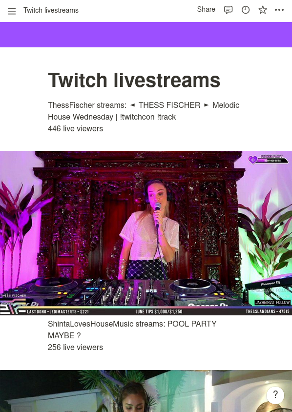

# Notion Twitch Dashboard

This lightweight application automatically updates your notion page with infos about ongoing livestreams.

## Example result

    

## Usage 

Download the full application under releases or build it yourself.

Run it once to get a config file and add your credentials.
Twitch channels must be comma-separated.

After this, run it again to let your page get updated automatically.